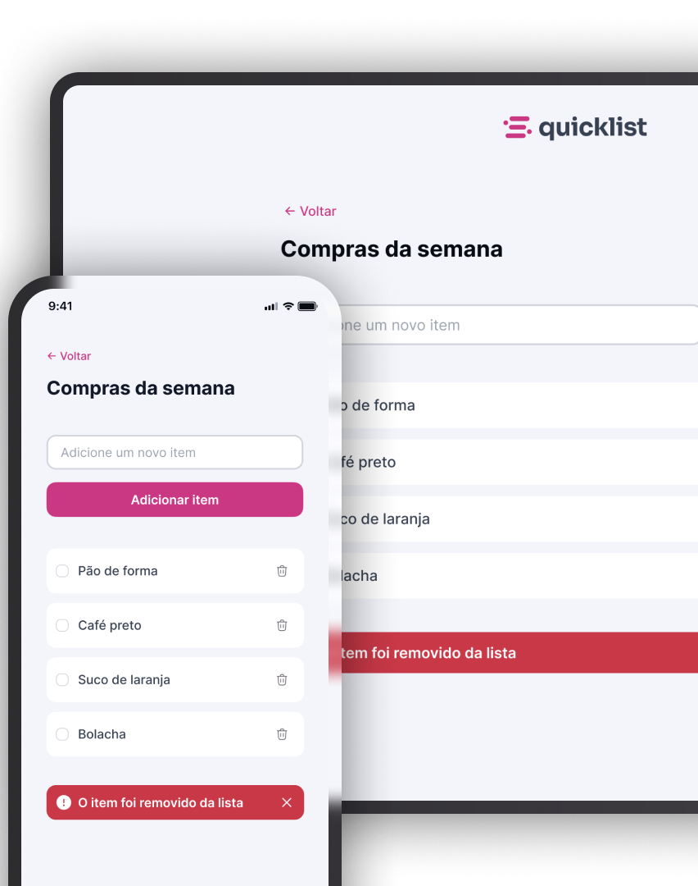

# QuickList

  

## 🚀 Tecnologias
Esse projeto foi desenvolvido com as seguintes tecnologias:
- HTML
- CSS
- JavaScript

## 📚 Descrição
QuickList é uma aplicação web que permite aos usuários criarem e gerenciarem suas listas de compras de forma simples e prática. O projeto foi desenvolvido como parte do curso Full-Stack da Rocketseat, com o objetivo de aplicar e praticar os conhecimentos adquiridos em JavaScript e em desenvolvimento web.